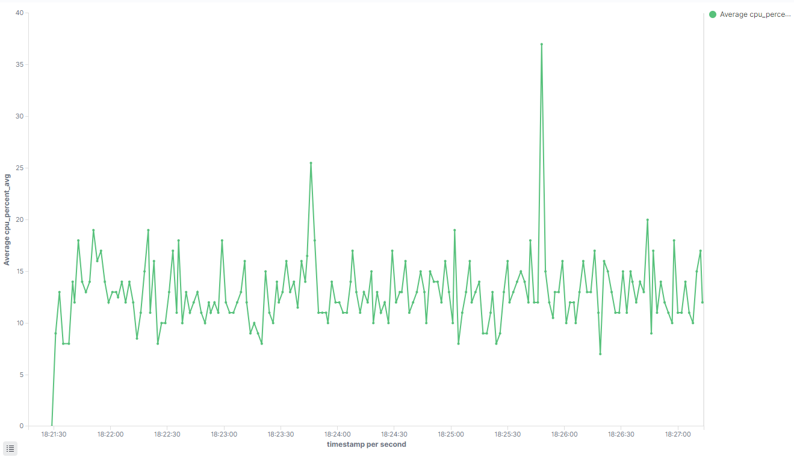
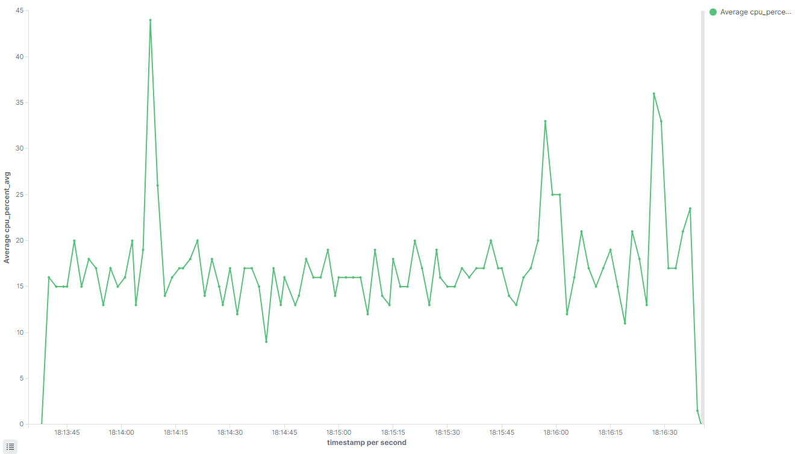

# 🚀 Payment Processor - Benchmarking OpenSearch Connection Pool

## 📌 Sobre o Projeto
Este projeto tem como objetivo analisar o impacto do uso de **Connection Pooling** no desempenho de operações realizadas no **OpenSearch**. O estudo compara cenários **com e sem pool de conexões**, utilizando diferentes cargas de requisições e níveis de concorrência para identificar os ganhos de performance.

### 🔍 **Motivação**
Sistemas distribuídos que realizam diversas chamadas ao OpenSearch podem enfrentar gargalos devido ao tempo de abertura e fechamento de conexões. **Connection Pooling** permite a reutilização de conexões, reduzindo a latência e melhorando a escalabilidade.

## 🛠️ **Tecnologias Utilizadas**
- **Java 17**
- **Spring Boot**
- **OpenSearch 2.x**
- **Maven**
- **ExecutorService** para concorrência
- **Docker** (para monitoramento e execução do OpenSearch)

## 📊 **Resultados Obtidos nos Testes**
Executamos uma série de testes para medir o impacto do Connection Pooling, variando:
1. **Carga de requisições**: 1.000, 5.000, 10.000 e 100.000 operações.
2. **Concorrência**: execução paralela com múltiplas threads.
3. **Uso de Connection Pooling**: comparação entre cenários com e sem pool.

### **Tabela de Resultados**

| Cenário                 | Carga   | Tipo             | Threads | Tempo Total (ms) | Tempo (s)   | Tempo (min)  |
|-------------------------|---------|-----------------|---------|-----------------|-------------|--------------|
| **Sem Pool**           | 5.000   | Multithreading  | 10      | **15.092 ms**   | **15.09 s** | **0.25 min** |
| **Com Pool**           | 5.000   | Multithreading  | 10      | **10.858 ms**   | **10.86 s** | **0.18 min** |
| **Com Pool**           | 5.000   | Multithreading  | 20      | **10.061 ms**   | **10.06 s** | **0.17 min** |
| **Sem Pool**           | 5.000   | Multithreading  | 20      | **21.742 ms**   | **21.74 s** | **0.36 min** |
| **Sem Pool**           | 10.000  | Multithreading  | 20      | **40.288 ms**   | **40.29 s** | **0.67 min** |
| **Com Pool**           | 10.000  | Multithreading  | 20      | **19.092 ms**   | **19.09 s** | **0.32 min** |
| **Com Pool**           | 100.000 | Multithreading  | 20      | **178.745 ms**  | **178.7 s** | **2.98 min** |
| **Sem Pool**           | 100.000 | Multithreading  | 20      | **347.785 ms**  | **347.8 s** | **5.80 min** |
### **📌 Análise dos Resultados**
✅ **O Connection Pool melhorou o tempo de execução em todos os casos com concorrência.** 🚀  
✅ **Para 10.000 requisições e 20 threads, o tempo reduziu em ~52%.**  
✅ **Com mais threads e alta carga, a vantagem do pooling se torna evidente.**

#### **📊 Consumo de CPU sem Connection Pool**

Os resultados abaixo foram plotados através do script `/scripts/monitor_cpu_opensearch.sh` usando o próprio Opensearch.



#### **📊 Consumo de CPU com Connection Pool**


---

## ⚡ **Conclusão**
O uso de Connection Pooling **traz benefícios significativos** para sistemas que realizam diversas chamadas ao OpenSearch de forma concorrente. No entanto, para cargas pequenas ou chamadas sequenciais, o impacto é menos expressivo. **Otimizações adicionais, como ajuste no tamanho do pool e tuning do OpenSearch, podem trazer ganhos adicionais.**

## 🚀 **Como Rodar o Projeto**
### 📌 **Pré-requisitos**
- Java 17+
- Docker (para rodar o OpenSearch)
- Maven

### 📌 **Passos para Executar**
1. Clone o repositório:
   ```sh
   git clone https://github.com/bquerino/sqs-to-opensearch.git
   cd app
   ```
2. Suba o OpenSearch com Docker:
   ```sh
   docker-compose up
   ```
3. Compile e rode o projeto:
   ```sh
   mvn clean install
   mvn spring-boot:run
   ```
   
## 📌 **Monitoramento**
### **Verificar uso de conexões no OpenSearch**
```sh
curl -X GET "http://localhost:9200/_nodes/stats/http?pretty"
```

### **Checar tarefas pendentes no OpenSearch**
```sh
curl -X GET "http://localhost:9200/_cluster/pending_tasks?pretty"
```

### **Alternar a forma de execução - Habilitar e desabilitar o connection pool**

A aplicação usa o parâmetro no arquivo `application.properties` para alternar entre habilitar e desabilitar o connection pool através da propriedade:

```properties
opensearch.usePool=false
```

## 📜 **Licença**
Este projeto está licenciado sob a **MIT License** - veja o arquivo [LICENSE](LICENSE) para mais detalhes.

